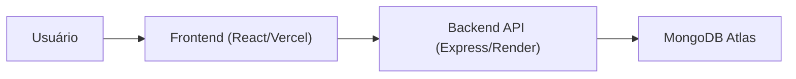

# Cadastro de Clientes Full Stack

Sistema full stack para cadastro e consulta de clientes, com frontend em React e backend em Node.js/Express integrado ao MongoDB Atlas.

[](https://cadastro-clientes-fullstack.vercel.app/)
[](https://cadastro-clientes-fullstack.onrender.com/)
[](https://www.mongodb.com/atlas)

## Preview


```md
## Deploy

- Frontend: [https://cadastro-clientes-fullstack.vercel.app/](https://cadastro-clientes-fullstack.vercel.app/)
- Backend: [https://cadastro-clientes-fullstack.onrender.com/](https://cadastro-clientes-fullstack.onrender.com/)
```

## Sobre o Projeto

Este projeto demonstra uma aplicação web completa com foco em:

- separação clara entre frontend e backend
- validação de dados no cliente e no servidor
- organização em camadas para facilitar manutenção e evolução
- deploy em produção com Vercel + Render

## Funcionalidades

- Cadastro de clientes
- Listagem em tabela
- Busca por nome
- Ordenação alfabética
- Paginação
- Mensagens de erro de validação/duplicidade

## Diferenciais Técnicos

- Arquitetura em camadas no backend (`routes`, `controllers`, `models`, `config`)
- Componentização no frontend com regras de negócio em `utils`
- CORS baseado em whitelist (`CORS_ORIGINS`) para ambientes reais
- Health checks da API para validação de disponibilidade (`/` e `/status`)

## Arquitetura (Visão Geral)



## Executar Localmente

### Requisitos

- Node.js 18+
- npm 9+
- Git
- MongoDB local ou conta no MongoDB Atlas

### Passo a passo

1. Clonar repositório

```bash
git clone https://github.com/guilhermehgl/cadastro-clientes-fullstack.git
cd cadastro-clientes-fullstack
```

2. Configurar variáveis de ambiente

```env
# backend/.env
PORT=3000
MONGO_URI=mongodb://127.0.0.1:27017/clientesdb
CORS_ORIGINS=http://localhost:5173
```

```env
# frontend/.env
VITE_API_URL=http://localhost:3000
```

3. Subir backend

```bash
cd backend
npm install
npm start
```

4. Subir frontend (novo terminal)

```bash
cd frontend
npm install
npm run dev
```

### Acessos locais

- Frontend: `http://localhost:5173`
- Backend: `http://localhost:3000`


## Documentação Técnica por Camada

Para detalhes técnicos completos, consulte:

- Frontend: [frontend/README.md](./frontend/README.md)
- Backend: [backend/README.md](./backend/README.md)

## Melhorias Futuras

- Autenticação/autorização (JWT)
- Edição e exclusão de clientes
- Testes automatizados (unitários/integrados)
- CI/CD com validações automáticas

## Autor

**Guilherme Henrique Guimarães Lima**

- GitHub: [@guilhermehgl](https://github.com/guilhermehgl)
