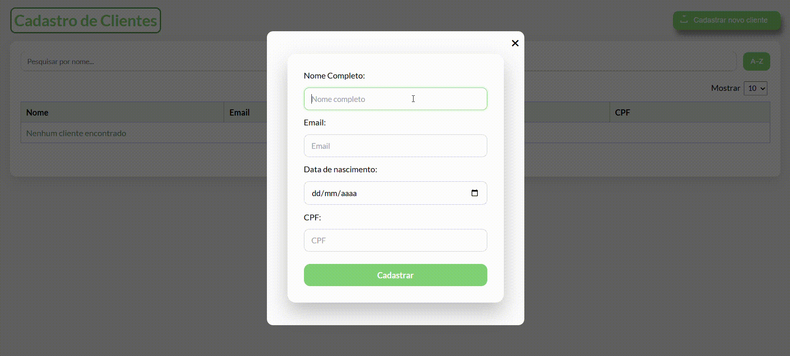
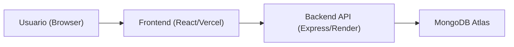

# Cadastro de Clientes Full Stack

Sistema full stack para cadastro e gestão de clientes, com foco em boas práticas de arquitetura, validação de dados e experiência de uso.

[](https://cadastro-clientes-fullstack.vercel.app/)
[](https://cadastro-clientes-fullstack.onrender.com/)
[](https://www.mongodb.com/atlas)
[](https://cadastro-clientes-fullstack.vercel.app/)

## Preview



## Sobre o Projeto

Este projeto simula um cenário real de aplicação web para cadastro de clientes, com:

- frontend React para interface e interação do usuário
- backend Node.js + Express para API REST
- MongoDB Atlas para persistência em nuvem
- deploy em produção com Vercel (frontend) e Render (backend)

## Funcionalidades

- Cadastro de clientes via modal
- Listagem de clientes em tabela
- Pesquisa por nome
- Ordenação alfabética (A-Z e Z-A)
- Paginação
- Validação de formulário no frontend
- Validação de dados e tratamento de erros no backend
- Mensagens de erro amigáveis para duplicidade (email/cpf)

## Diferenciais Técnicos

- Separação por camadas no backend (`routes`, `controllers`, `models`, `config`)
- Frontend componentizado com responsabilidades bem definidas
- CORS com whitelist configurável por variável de ambiente (`CORS_ORIGINS`)
- Tratamento explícito de erros de validação e duplicidade no MongoDB
- API com endpoint de health check (`/status`) para observabilidade básica
- Configuração pronta para ambiente local e produção

## Stack de Tecnologias

### Frontend


### Backend


## Arquitetura (Visão Simples)



## Como Executar Localmente

### 1. Clonar o repositório

```bash
git clone https://github.com/guilhermehgl/cadastro-clientes-fullstack.git
cd cadastro-clientes-fullstack
```

### 2. Configurar variáveis de ambiente

Crie os arquivos:

- `backend/.env`
- `frontend/.env`

Com os valores:

```env
# backend/.env
PORT=3000
MONGO_URI=mongodb://127.0.0.1:27017/clientesdb
CORS_ORIGINS=http://localhost:5173
```

```env
# frontend/.env
VITE_API_URL=http://localhost:3000
```

### 3. Subir o backend

```bash
cd backend
npm install
npm start
```

### 4. Subir o frontend

Em outro terminal:

```bash
cd frontend
npm install
npm run dev
```

Aplicação local em:

- Frontend: `http://localhost:5173`
- Backend: `http://localhost:3000`

## Variáveis de Ambiente

### Backend

| Variável | Obrigatória | Descrição | Exemplo |
|---|---|---|---|
| `PORT` | Não | Porta da API | `3000` |
| `MONGO_URI` | Sim | String de conexão com MongoDB | `mongodb+srv://...` |
| `CORS_ORIGINS` | Sim (produção) | Origens permitidas, separadas por vírgula | `http://localhost:5173,https://seu-app.vercel.app` |

### Frontend

| Variável | Obrigatória | Descrição | Exemplo |
|---|---|---|---|
| `VITE_API_URL` | Sim | URL base da API | `http://localhost:3000` |

## Endpoints da API

Base URL (produção): `https://cadastro-clientes-fullstack.onrender.com`

| Método | Rota | Descrição | Status |
|---|---|---|---|
| `GET` | `/` | Health check simples | `200` |
| `GET` | `/status` | Health check | `200` |
| `GET` | `/clientes` | Lista clientes cadastrados | `200` |
| `POST` | `/clientes` | Cria novo cliente | `201`, `400` |

### Exemplo de payload (POST `/clientes`)

```json
{
  "nome": "Joao Silva",
  "email": "joao@email.com",
  "dataNascimento": "1995-08-10",
  "cpf": "123.456.789-00"
}
```

## Deploy

- Frontend (Vercel): [https://cadastro-clientes-fullstack.vercel.app/](https://cadastro-clientes-fullstack.vercel.app/)
- Backend (Render): [https://cadastro-clientes-fullstack.onrender.com/](https://cadastro-clientes-fullstack.onrender.com/)

Para produção, manter no backend:

- `MONGO_URI` apontando para MongoDB Atlas
- `CORS_ORIGINS` contendo o domínio do frontend publicado

## Melhorias Futuras

- Implementar autenticação e autorização (JWT)
- Adicionar edição e exclusão de clientes
- Cobertura com testes unitários e de integração
- Logs estruturados e monitoramento de erros

## Autor

**Guilherme Henrique Guimaraes Lima**

- GitHub: [@guilhermehgl](https://github.com/guilhermehgl)

